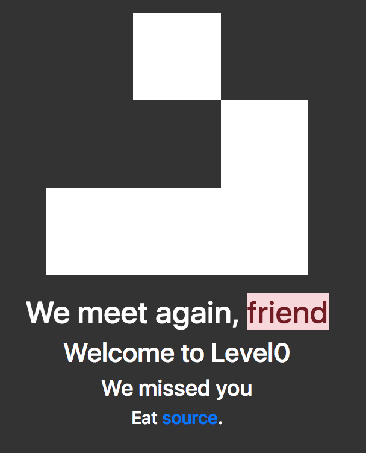

# Extended Webapp Security (COMP6843)

## Dependent URLS
* Pastebin Of Source - https://pastebin.com/FEv7c4tA

## Challenges and Flags
| Exploit Type | Level | Flag |
| --- | --- | --- |
| Serialize | 0 | EXTBREAK3{A_c3RiAl_kIlLeR} |

## PHP unserialize
### Level0


#### Starting up the Challenge Server
```sh
cd break2/serialize
docker-compose up -d
```

#### Shutting down the Challenge Server
```sh
docker-compose down
```

#### Writeup / Walkthrough
1. Edit the cookie named `level0`
2. Provision payload that instantiates a `print_flag` object.

By default, the cookie value is set to become the value.

```
s%3A6%3A%22friend%22%3B
```

This is the URL encoded form of the serialised string `s:6:"friend";`

By encoding a serialized object within the `level0` cookie, we exploit `$flagObj = unserialize($_COOKIE['level0']);`, in particular the unserialize function.
In order to get the `__tostring()` function of the `print_flag` object to be run when `echo '<span class="alert-success">' . $flagObj  . '</span>';` is hit, running the `__tostring()` method of `print_flag`.

The following payload will cause the flag to be released.
```
O%3A10%3A%22print_flag%22%3A0%3A%7B%7D
```

This url decodes to `O:10:"print_flag":0:{}`. This payload provides the serialised form of an object according to [PHP Serialize](https://secure.php.net/manual/en/function.serialize.php).

`O:strlen(object name):object name:object size:{s:strlen(property name):property name:property definition;(repeated per property)}`
